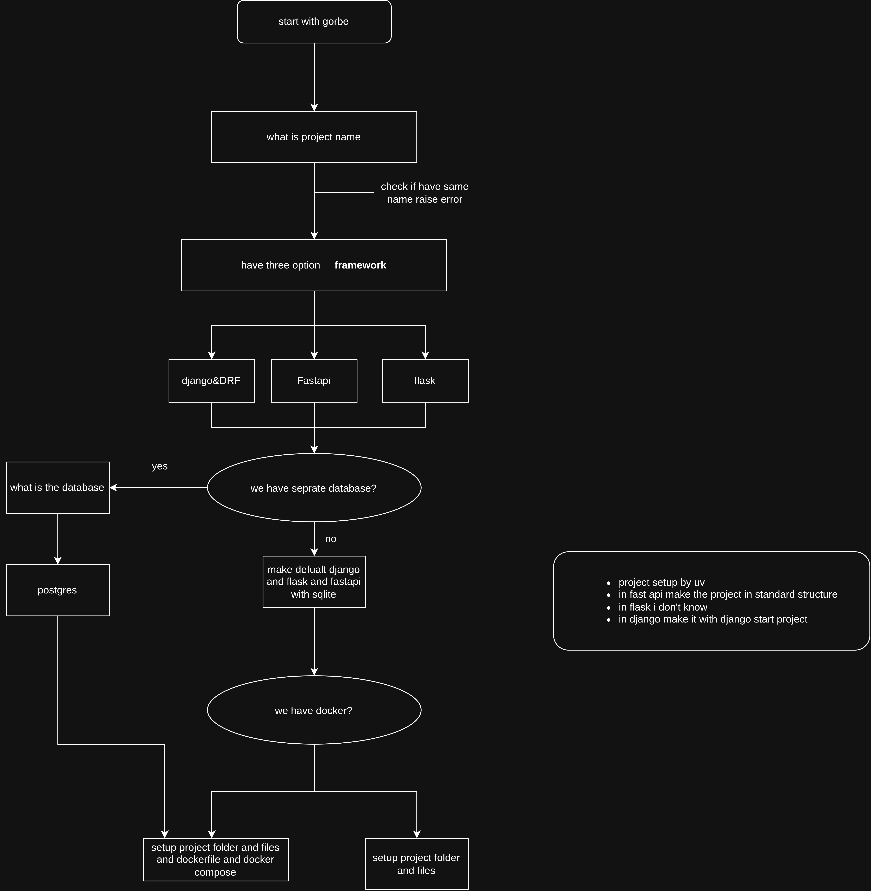

# Gorbe

### python command-line utility to setup project

it use for fastapi flask and django
in teminal for setup project

##### features
setup with uv\
setup with standard project structure\
install all pakeges\
optional to add dockerfile and docker compose.yaml\

##### project diagram

